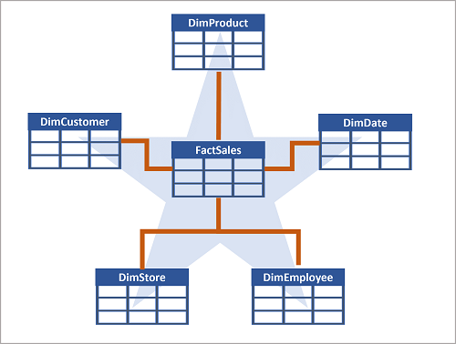
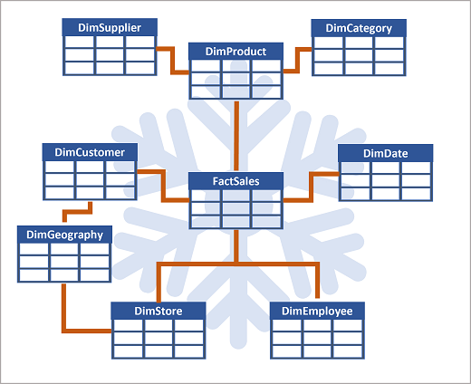

# Design a data warehouse schema

Like all relational databases, a data warehouse contains tables in which the data you want to analyze is stored. Most commonly, these tables are organized in a schema that is optimized for **multi-dimensional modeling**, in which numerical measures associated with events known as **facts** can be aggregated by the attributes of associated entities across multiple **dimensions**. 

## Tables in a data warehouse

A common pattern for relational data warehouses is to define a schema that includes two kinds of table: *dimension tables* and *fact tables*.

### Dimension tables

Dimension tables describe **business entities**, such as products, people, places, and dates. Dimension tables contain columns for attributes of an entity. 

In addition to attribute columns, a dimension table contains a **unique key column** that uniquely identifies each row in the table. In fact, it's common for a dimension table to include two key columns:
- a **surrogate key** that is specific to the data warehouse and uniquely identifies each row in the dimension table in the data warehouse (usually an incrementing integer number)
- an **alternate key**, often a natural or business key that is used to identify a specific instance of an entity in the transactional source system from which the entity record originated (e.g. *product code* or a *customer ID*).

Why have two keys ?
- the data warehouse may be populated with data from multiple source systems, which can lead to the risk of duplicate or incompatible business keys
- simple numeric keys generally perform better in queries that join lots of tables (a common pattern in data warehouses)
- since the data warehouse is used to support historic reporting, attributes of entities may change over time (different surrogate keys for the same business key)

### Date Dimension

In addition to dimension tables that represent business entities, it's common for a data warehouse to include **a dimension table that represents time**. 

This table enables data analysts to aggregate data over temporal intervals. Depending on the type of data you need to analyze, the lowest granularity (referred to as the *grain*) of a time dimension could represent times (to the hour, second, millisecond, nanosecond, or even lower), or dates.

### Fact tables

Fact tables store **details of observations or events**. A fact table contains columns for numeric values that can be aggregated by dimensions. In addition to the numeric columns, a fact table contains key columns that reference unique keys in related dimension tables.

A fact table's dimension key columns determine its grain. 

## Data warehouse schema designs

In most transactional databases that are used in business applications, the data is normalized to reduce duplication. In a data warehouse however, the dimension data is generally de-normalized to reduce the number of joins required to query the data.

Often, a data warehouse is organized as a star schema, in which a fact table is directly related to the dimension tables.

When an entity has a large number of hierarchical attribute levels, or when some attributes can be shared by multiple dimensions, it can make sense to apply some normalization to the dimension tables and create a **snowflake schema**.

