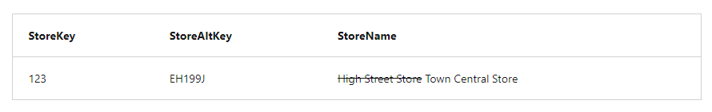
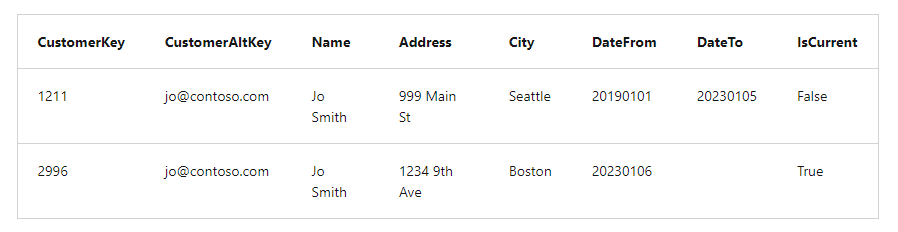

## Load slowly changing dimensions

In most relational data warehouses, you need to handle updates to dimension data and support what are commonly referred to as **Slowly Changing Dimensions (SCDs)**.

There are multiple kinds of slowly changing dimension, of which three are commonly implemented:
- **Type 0**
    - Dimension data can't be changed
    - Any attempted changes fail
- **Type 1 (overwrite)**
    - Dimension record is updated in-place
    - Changes made to an existing dimension row apply to all previously loaded facts related to the dimension

    

- **Type 2 (add new row)**
    - A change to a dimension results in a new dimension row
    - Existing rows for previous versions of the dimension are retained for historical fact analysis and the new row is applied to future fact table entries
    - Dimensions often include columns to track the effective time periods for each version of an entity, and/or a flag to indicate which row represents the current version of the entity (with these approaches, the logic for a type 2 change must include an INSERT of the new dimension row and an UPDATE to mark the current row as inactive)

    

