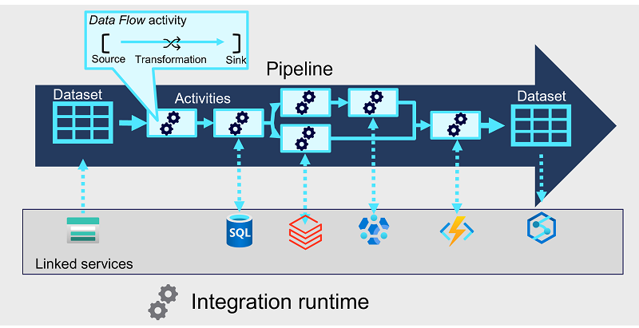

# Pipelines in Azure Synapse Analytics

Pipelines in Azure Synapse Analytics encapsulate a sequence of activities that perform data movement and processing tasks. 

You can use a pipeline to define data transfer and transformation activities, and orchestrate these activities through control flow activities that manage branching, looping, and other typical processing logic. 

Core pipeline concepts:
- **Activities**
    - They are the **executable tasks** in a pipeline
    - You can define a flow of activities by connecting them in a sequence
    - The outcome of a particular activity (success, failure, or completion) can be used to direct the flow to the next activity in the sequence
- **Integration runtime**
    - It provides compute resources and an execution context
    - It is used to initiate and coordinate the activities in the pipeline
- **Linked services**
    - They enable secure connections to the external services 
    - They are defined at *workspace level* and can be shared across multiple pipelines
- **Datasets**
    - They define the schemas for each data object that will be used in the pipeline
    - They have an associated linked service to connect to its source Activities can have datasets as inputs or outputs
    - They are defined at *workspace level* and can be shared across multiple pipelines

## Pipelines in Azure Synapse Studio

When you create a pipeline in Azure Synapse Studio, you can use the graphical design interface.

The pipeline designer includes a set of activities, organized into categories, which you can drag onto a visual design canvas. You can select each activity on the canvas and use the properties pane beneath the canvas to configure the settings for that activity. To define the logical sequence of activities, you can connect them by using the *Succeeded*, *Failed*, and *Completed* dependency conditions, which are shown as small icons on the right-hand edge of each activity.

While the graphical development environment is the preferred way to create a pipeline, you can also create or edit the underlying JSON definition of a pipeline. 

Triggers can be defined to run the pipeline:
- Immediately
- At explicitly scheduled intervals
- In response to an event (i.e. such a new data files being added to a folder)

