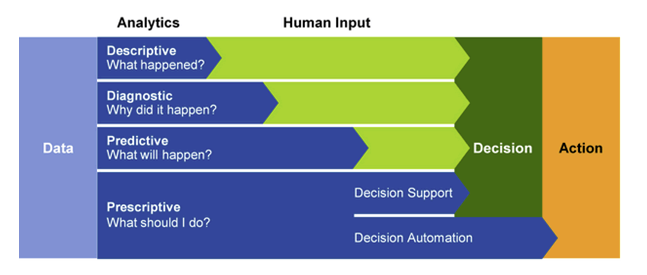

# What is Azure Synapse Analytics

Gartner defines four common types of analytical technique that organizations commonly use:
- Descriptive analytics
- Diagnostic analytics
- Predictive analytics
- Prescriptive analytics

## Azure Synapse Analytics

**Azure Synapse Analytics** provides a cloud platform for all of these analytical workloads through support for multiple data storage, processing, and analysis technologies in a single integrated solution. 

The integrated design of Azure Synapse Analytics enables organizations to leverage investments and skills in multiple commonly used data technologies, while providing a centrally managed service and a single, consistent user interface.